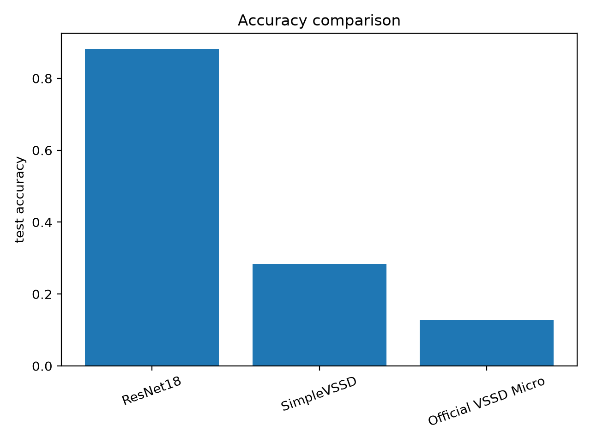
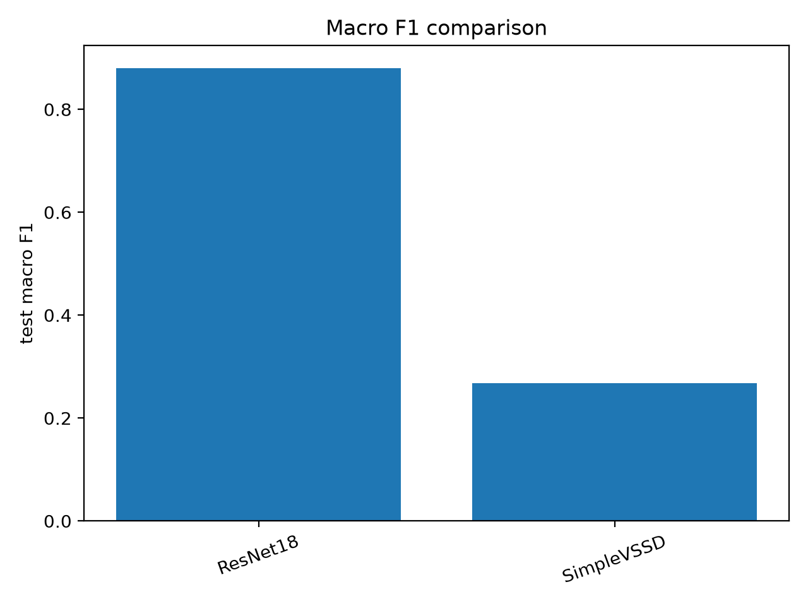
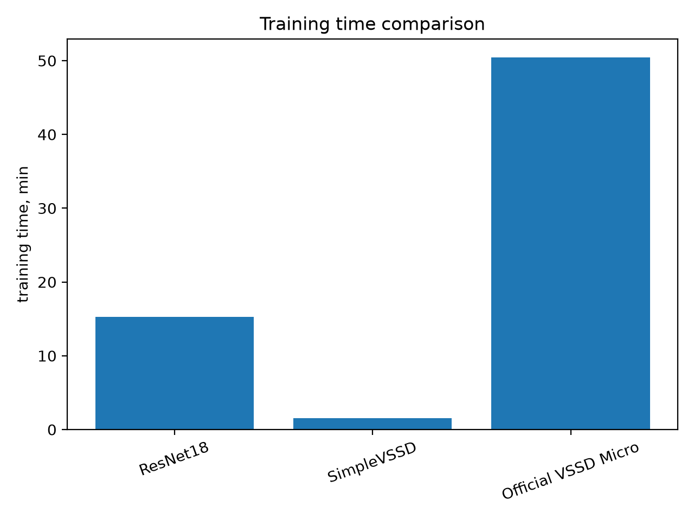

# Домашнее задание 1. Использование VSSD

## Цель работы

Изучить архитектуру VSSD и сравнить её с другими моделями на задаче классификации изображений.

## Вычислительная конфигурация

Эксперимент проводился на MacBook Air M4 с использованием CPU и библиотеки PyTorch.

## Датасет

Для эксперимента использовался датасет CIFAR-10, содержащий изображения 10 различных классов.

## Модели

Были рассмотрены три модели:

* ResNet18
* SimpleVSSD
* Official VSSD Micro

## Графики

### Сравнение Accuracy

### Сравнение F1-score

### Сравнение времени обучения

## Результаты

| Модель              | Accuracy | F1-score | Время обучения |
| ------------------- | -------: | -------: | -------------: |
| ResNet18            |   0.8815 |   0.8802 |     917.87 сек |
| SimpleVSSD          |   0.2835 |   0.2683 |      92.82 сек |
| Official VSSD Micro |   0.1283 |        — |       3025 сек |

Также были построены графики сравнения точности, F1-меры и времени обучения.

## Вывод

Лучший результат показала модель ResNet18 с точностью 88.15%.

SimpleVSSD обучалась быстрее остальных моделей, однако её качество оказалось значительно ниже.

Официальная реализация VSSD была успешно запущена и обучена, однако показала точность всего 12.83%. Вероятно, это связано с обучением на небольшой выборке данных, малым количеством эпох и отсутствием GPU.

В рамках данного эксперимента VSSD не смогла превзойти ResNet18 по качеству классификации изображений. Тем не менее удалось изучить архитектуру VSSD, запустить официальную реализацию и сравнить её с другими подходами.
