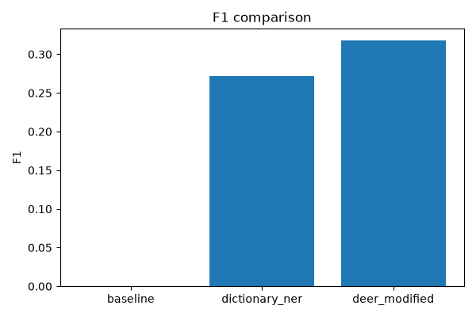
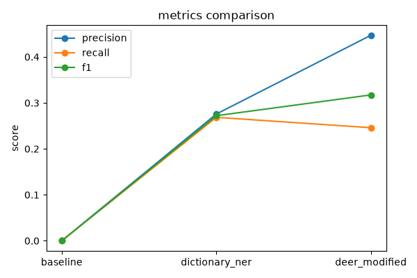

# Домашнее задание 2. Использование DEER

## 1. Цель работы

Цель работы — изучить подход DEER для задачи распознавания именованных сущностей (NER) и проверить его работу на текстовом корпусе.

В работе была реализована собственная упрощенная версия DEER и проведено сравнение с более простыми методами.

## 2. Вычислительная конфигурация

Эксперимент проводился на MacBook Air M4 с использованием Python 3.

Используемые библиотеки:

* pandas
* matplotlib
* seqeval
* datasets

GPU не использовался.

## 3. Датасет

В качестве корпуса использовался датасет CoNLL-2003 для задачи распознавания именованных сущностей.

В датасете размечены следующие типы сущностей:

* PER — человек;
* ORG — организация;
* LOC — место;
* MISC — другие сущности.

Для эксперимента использовались обучающая и тестовая выборки датасета.

## 4. Реализация

Были рассмотрены три метода.

### Baseline

Самый простой метод. Для каждого слова он предсказывает, что сущности нет.

### Dictionary NER

По обучающей выборке строится словарь сущностей. Если слово встречалось как сущность, ему назначается самый частый тип сущности.

### DEER-Modified

В предложенной версии DEER для каждого слова считается, насколько часто оно встречается:

* внутри сущности;
* рядом с сущностью;
* вне сущности.

После этого для тестового предложения выбираются наиболее подходящие примеры из обучающей выборки. По этим примерам строится локальный словарь сущностей, который используется для предсказания меток.

## 5. Результаты

Результаты эксперимента представлены в таблице 1.

### Таблица 1. Результаты методов

| Метод          | Precision | Recall |    F1 |
| -------------- | --------: | -----: | ----: |
| Baseline       |     0.000 |  0.000 | 0.000 |
| Dictionary NER |     0.276 |  0.269 | 0.272 |
| DEER-Modified  |     0.447 |  0.246 | 0.317 |

Ниже показано сравнение методов по метрике F1.

Рисунок 1. Сравнение F1-score различных методов.

Из рисунка видно, что DEER-Modified показывает лучший результат среди всех рассмотренных методов. Значение F1 выросло с 0.272 до 0.317 по сравнению с Dictionary NER.

Ниже показано сравнение всех метрик качества.

Рисунок 2. Сравнение Precision, Recall и F1 различных методов.

Можно заметить, что DEER-Modified имеет самую высокую точность (Precision = 0.447). Это означает, что метод реже ошибается при определении сущностей.

## 6. Выводы

В работе был изучен подход DEER для задачи распознавания именованных сущностей.

Были сравнены три метода: Baseline, Dictionary NER и DEER-Modified. Лучший результат показал DEER-Modified с F1-score = 0.317.

Полученные результаты показывают, что использование информации о том, как слова связаны с сущностями, помогает улучшить качество распознавания по сравнению с обычным словарным подходом.

Хотя реализованная версия является упрощенной по сравнению с оригинальной статьей, она показала улучшение качества и подтвердила полезность идей DEER для задачи NER.
