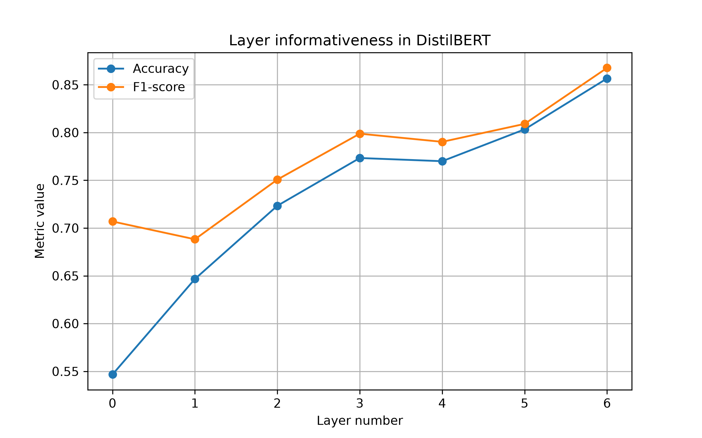

# Домашнее задание 4. Поиск информативного скрытого слоя в LLM

## Цель работы

Целью работы является исследование распределения информации по слоям большой языковой модели и определение наиболее информативных слоев для задачи классификации текста.

В качестве основы использовалась идея из статьи HiProbe-VAD, согласно которой наиболее полезные признаки для прикладных задач могут находиться не только в последнем слое модели, но и в промежуточных слоях.

---

## Вычислительная конфигурация

Эксперимент проводился на MacBook Air M4 с использованием библиотеки PyTorch.

Для ускорения вычислений использовались готовые предобученные модели из библиотеки Transformers.

---

## Датасет

Для эксперимента использовался датасет SST-2 (Stanford Sentiment Treebank 2), содержащий тексты с бинарной разметкой тональности.

Классы:

* 0 — отрицательная тональность;
* 1 — положительная тональность.

Для ускорения эксперимента использовалась подвыборка из 1200 текстов обучающей выборки.

---

## Модель

В качестве языковой модели была выбрана DistilBERT (`distilbert-base-uncased`).

Причины выбора:

* небольшое число параметров;
* возможность запуска на CPU;
* наличие скрытых представлений всех слоев;
* широкое применение в задачах анализа текста.

Модель содержит шесть трансформерных слоев.

---

## Методика эксперимента

Для каждого текста были получены скрытые представления всех слоев модели.

В качестве признакового описания использовался вектор `[CLS]`-токена каждого слоя.

Для каждого слоя отдельно был обучен классификатор Logistic Regression.

Качество оценивалось по следующим метрикам:

* Accuracy;
* F1-score.

Таким образом, для каждого слоя была получена собственная оценка качества классификации.

---

## Результаты

### Таблица результатов

| Слой | Accuracy | F1-score |
| ---- | -------- | -------- |
| 0    | 0.5467   | 0.7069   |
| 1    | 0.6467   | 0.6882   |
| 2    | 0.7233   | 0.7508   |
| 3    | 0.7733   | 0.7988   |
| 4    | 0.7700   | 0.7903   |
| 5    | 0.8033   | 0.8091   |
| 6    | 0.8567   | 0.8677   |

---

### График качества по слоям

На графике показана зависимость Accuracy и F1-score от номера слоя модели.

---

## Анализ результатов

Полученные результаты показывают, что качество классификации постепенно увеличивается при переходе к более глубоким слоям модели.

Входные представления (слой 0) содержат ограниченную информацию о смысле текста и обеспечивают относительно низкое качество классификации.

Начиная со второго и третьего слоев наблюдается заметный рост метрик. Это говорит о том, что модель постепенно формирует более содержательные семантические признаки.

Лучший результат был получен на последнем слое модели:

* Accuracy = 0.8567;
* F1-score = 0.8677.

По сравнению с входными эмбеддингами качество выросло более чем на 30 процентных пунктов по Accuracy.

---

## Сравнение различных групп слоев

### Начальные слои (0–1)

Начальные слои в основном содержат информацию о токенах и локальных языковых закономерностях.

Качество классификации на этих слоях оказалось самым низким.

### Промежуточные слои (2–4)

На промежуточных слоях наблюдается существенное улучшение качества.

Это свидетельствует о формировании более сложных семантических представлений текста.

### Финальные слои (5–6)

Финальные слои показали наилучшие результаты.

Именно на них содержатся наиболее информативные признаки для задачи классификации тональности.

---

## Заключение

В данной работе было исследовано распределение информации по слоям модели DistilBERT.

Для каждого слоя были извлечены скрытые представления текстов и обучен отдельный классификатор Logistic Regression.

Эксперимент показал, что наиболее информативным оказался последний слой модели, который обеспечил максимальные значения Accuracy и F1-score.

В отличие от некоторых исследований, где наилучшие признаки располагаются в промежуточных слоях, для задачи классификации тональности на датасете SST-2 наблюдался практически монотонный рост качества по мере увеличения номера слоя.

Полученные результаты показывают, что верхние слои DistilBERT содержат наиболее полезную семантическую информацию для решения задачи анализа тональности текста.