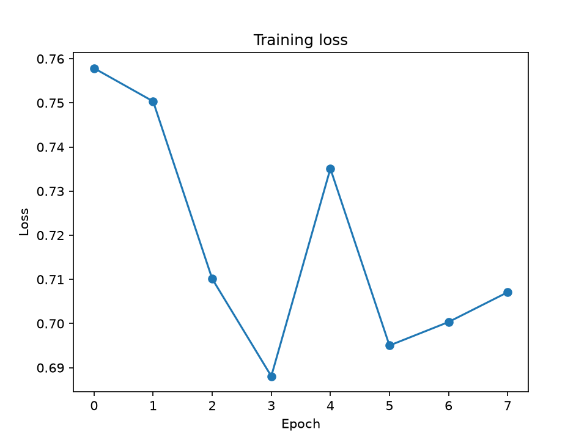
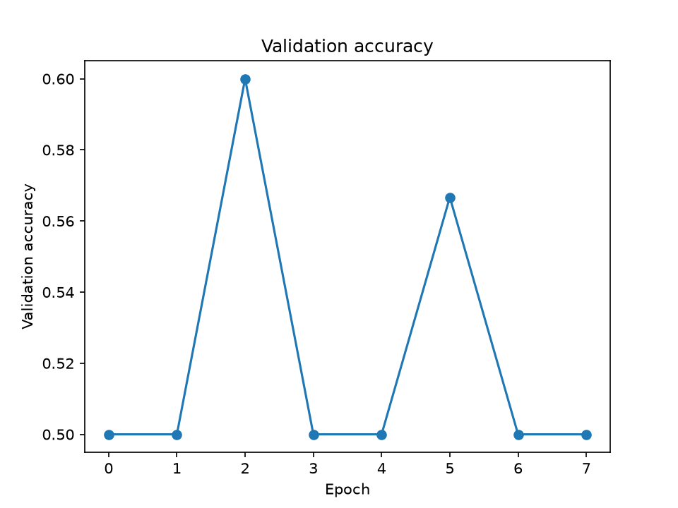

# Домашнее задание 5. Использование Depth Anything 3 для генерации данных и обучение Vision Transformer

## Цель работы

Целью работы было изучение применения современных transformer-based моделей для обработки изображений. В качестве модели из статьи использовалась Depth Anything 3, которая применялась для генерации depth-карт на основе RGB-изображений. На полученных данных был обучен собственный Vision Transformer для решения задачи классификации.

## Вычислительная конфигурация

Эксперимент проводился на ноутбуке MacBook Air с использованием библиотеки PyTorch и ускорителя MPS.

## Подготовка данных

Для эксперимента был создан синтетический датасет цветных изображений. Были сформированы два класса:

* circles — изображения с кругами;
* squares — изображения с квадратами.

Изображения были автоматически сгенерированы и разделены на обучающую и валидационную выборки.

## Генерация depth-карт

Для генерации новых данных использовалась модель Depth Anything 3 из официального репозитория статьи.

На вход модели подавались RGB-изображения синтетического датасета. В результате работы модели для каждого изображения была построена карта глубины (depth map). Полученные depth-карты были сохранены в отдельный датасет и использовались в дальнейшем для обучения собственной модели.

Таким образом, модель Depth Anything 3 использовалась в качестве генератора данных для последующей классификации.

## Обучение трансформера

После генерации depth-карт был обучен собственный Vision Transformer (TinyViT).

Модель использует механизм Multi-Head Self-Attention и Transformer Encoder для извлечения признаков из изображений. Обучение выполнялось на depth-картах, полученных с помощью модели Depth Anything 3.

Задача состояла в бинарной классификации изображений на классы circles и squares.

Обучение проводилось в течение 8 эпох.

## Результаты

Результаты обучения представлены в таблице.

| Эпоха | Loss   | Validation Accuracy |
| ----- | ------ | ------------------- |
| 1     | 0.7579 | 0.5000              |
| 2     | 0.7503 | 0.5000              |
| 3     | 0.7101 | 0.6000              |
| 4     | 0.6881 | 0.5000              |
| 5     | 0.7351 | 0.5000              |
| 6     | 0.6950 | 0.5667              |
| 7     | 0.7003 | 0.5000              |
| 8     | 0.7071 | 0.5000              |

Лучшее значение accuracy на валидационной выборке составило 0.60.

График функции потерь:

График точности:

## Анализ результатов

Модель смогла частично различать два класса изображений. Полученное качество оказалось относительно невысоким. Это связано с небольшим размером датасета, простотой синтетических изображений и ограниченным количеством эпох обучения.

Кроме того, depth-карты кругов и квадратов содержат сравнительно мало различающей информации, поскольку объекты являются простыми двумерными фигурами.

Несмотря на это, эксперимент показал, что depth-представления, полученные с помощью Depth Anything 3, могут использоваться в качестве входных данных для последующего обучения transformer-based моделей.

## Вывод

В ходе работы была использована модель Depth Anything 3 из официального репозитория статьи для генерации depth-карт на основе RGB-изображений.

На полученном наборе depth-карт был обучен собственный Vision Transformer с механизмом self-attention. Лучшее качество на валидационной выборке составило 0.60.

Таким образом, был реализован полный пайплайн, включающий генерацию данных с помощью модели из статьи и последующее обучение собственного трансформера на полученных данных.
